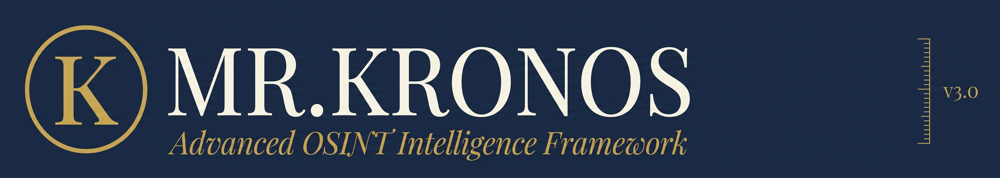
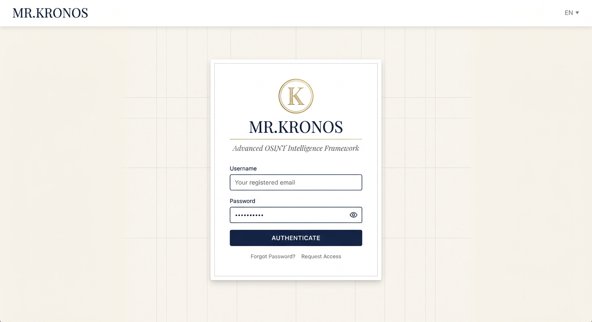
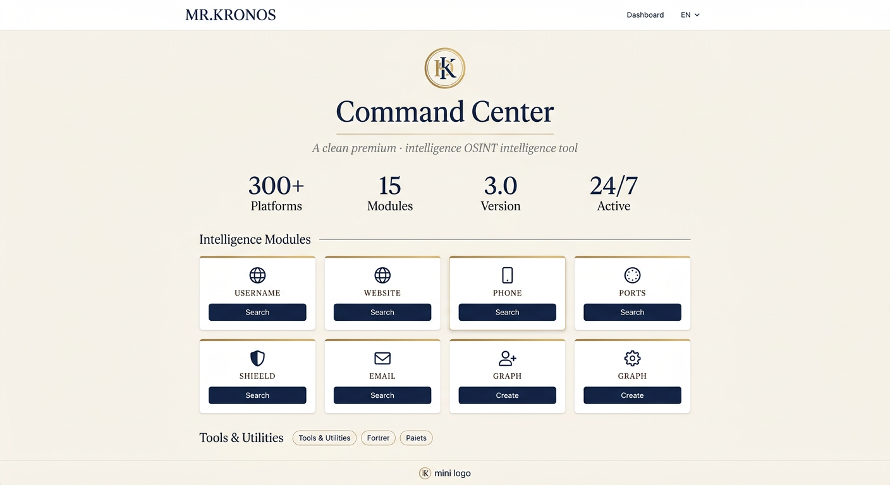
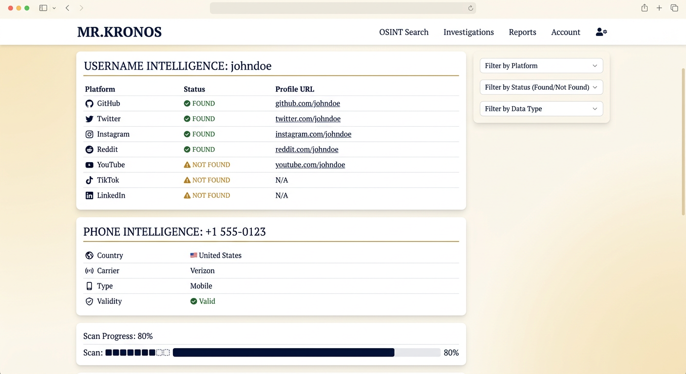
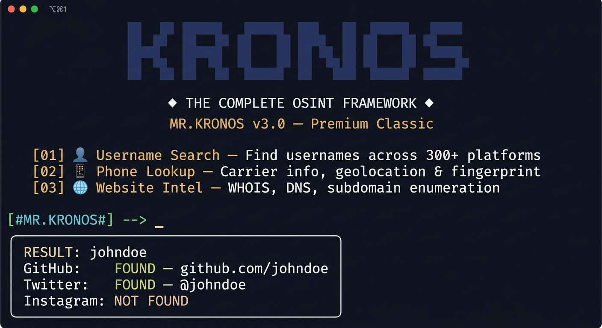

<p align="center">
  
</p>

<p align = "center">
  
  
  
  
  
  
  
</p>

# 🔮 Mr.Kronos v3.0 — Le Framework OSINT Complet

**Mr.Kronos est un outil de collecte d'informations (OSINT) avec une interface entièrement repensée. Le but principal est d'obtenir des informations sur les domaines, noms d'utilisateur, e-mails et numéros de téléphone via des ressources publiques. Il utilise Google/Yandex Dorks pour des recherches ciblées, des proxies pour l'anonymat, et une API WHOIS pour l'intelligence sur les domaines.**

<br>

## 📸 CAPTURES D'ÉCRAN

## 🔐 Portail de Connexion


## 📊 Tableau de Bord


## 🔍 Résultats d'Intelligence


## 🖥️ Terminal CLI


<br>

# ⚠️ AVERTISSEMENT
**Cet outil n'est pas précis à 100%. Il est créé à des fins éducatives et de recherche uniquement. Je n'assume aucune responsabilité pour toute utilisation incorrecte.**

<br>

# ✅ INSTALLATION LINUX/MAC:
```bash
git clone https://github.com/aryanhubhaimai/Mr.Kronos-OSINT
cd Mr.Kronos-OSINT
sudo apt-get update
sudo chmod +x install.sh
sudo bash install.sh
```
<br>

# ✅ INSTALLATION WINDOWS:
```cmd
git clone https://github.com/aryanhubhaimai/Mr.Kronos-OSINT
cd Mr.Kronos-OSINT
Install.cmd
```
<br>

# ✅ INSTALLATION TERMUX:
```bash
pkg install proot
git clone https://github.com/aryanhubhaimai/Mr.Kronos-OSINT
cd Mr.Kronos-OSINT
proot -0 chmod +x install_Termux.sh
./install_Termux.sh
```
<br>

# 🚀 UTILISATION LINUX/MAC:
    cd Mr.Kronos-OSINT
    sudo python3 MrKronos.py

<br>

# 🚀 UTILISATION WINDOWS:
    python MrKronos.py

<br>

# 🔑 CLÉ API:
    https://whois.whoisxmlapi.com
<br>

# ⚙️ CONFIGURATION:
    Configuration/Configuration.ini
<br>

# 🌍 LANGUES DISPONIBLES:
    Italiano 🇮🇹 
    English 🏴󠁧󠁢󠁥󠁮󠁧󠁿
    Français 🇫🇷

<br>

# 📌 VERSION ACTUELLE: T.G.D-1.0.4 (Kronos Design System 3.0)

<br>

<hr>
<br>

## <p align = center>⭐ STARGAZERS OVER TIME 

[](https://starchart.cc/aryanhubhaimai/Mr.Kronos-OSINT)

<br>

## <p align= center>CREE AVEC ❤️ PAR ARYAN EN 🇮🇳</p>

## <p align = center>CRÉATEUR ORIGINAL: <a href = "https://github.com/aryanhubhaimai">ARYAN</a></p>

## <p align = center>LICENCE: GPL-3.0 License <br>COPYRIGHT: © 2021-2026 Aryan</p>
